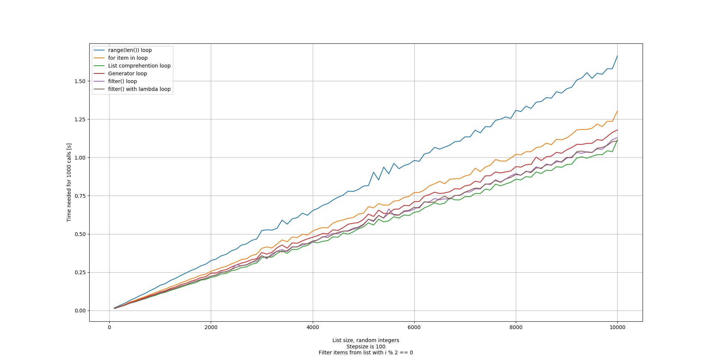

# RangeTrouble
Some Python loop examples to compare execution times of different implementations,
intended for training purposes.

Uses matplotlib to draw diagrams of execution times in dependence of list sizes.

# Installation
```bash
pip install -r requirements.txt
```

# Test
Simply run the python files, optionally change global variables to change stepsize
and other settings.
```bash
python rangetrouble.py
```

# Example Output

